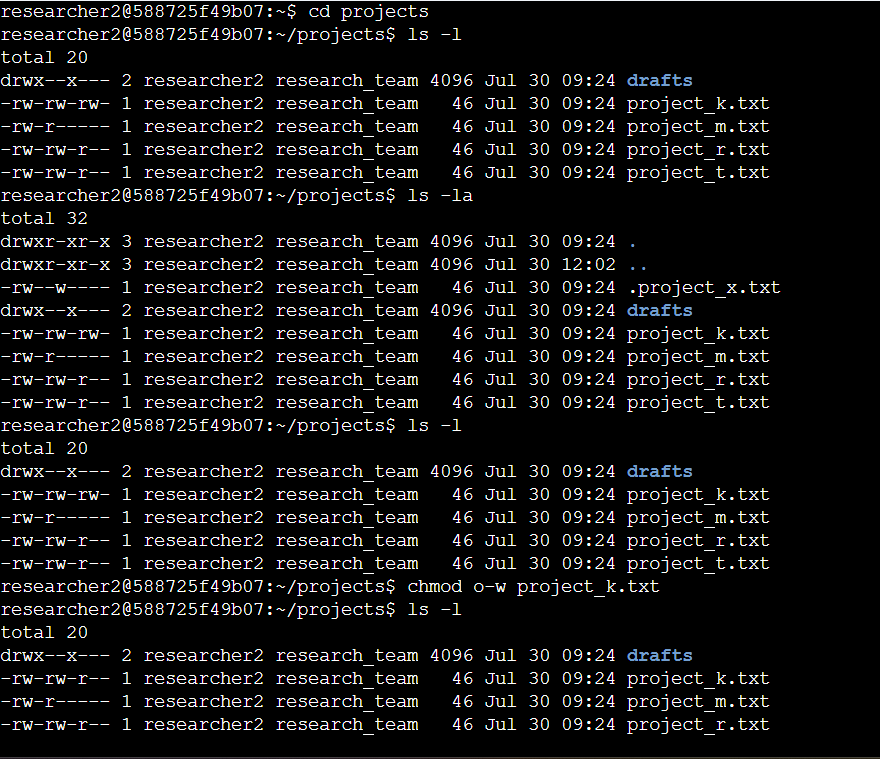
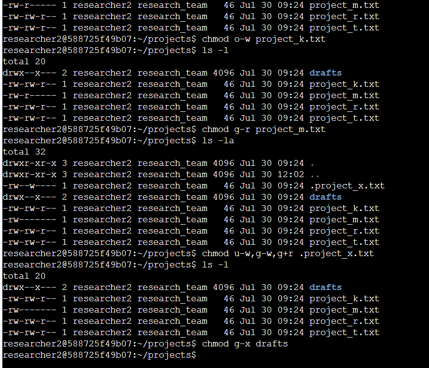

# Linux File Permissions Management

## Objective
Reviewed and updated file and directory permissions within a Linux project directory
to align access levels with security requirements — checking existing permissions,
interpreting the permission string, and applying targeted `chmod` changes.

## Check current permissions and change file permissions

Used `ls -la` to list all files and directories with full permission strings, including
hidden files. Removed excess write access from `project_k.txt` for "other" using
`chmod o-w project_k.txt`, since no external users should be able to modify files.

## Change permissions on a hidden file and directory

Adjusted `.project_x.txt` permissions using `chmod u-w,g-w,g+r .project_x.txt` to
remove write access from user and group while adding group read access. Restricted
the `drafts` directory using `chmod g-x drafts` so only the designated owner retained
execute access.

## Summary
Used `ls -la` to audit existing permissions, then applied targeted `chmod` changes to
enforce least-privilege access, removing unnecessary write and execute permissions to
match required access-control policy.

## Skills Demonstrated
Linux command-line administration, file permission auditing (`ls -la`), permission
modification (`chmod`), least-privilege enforcement