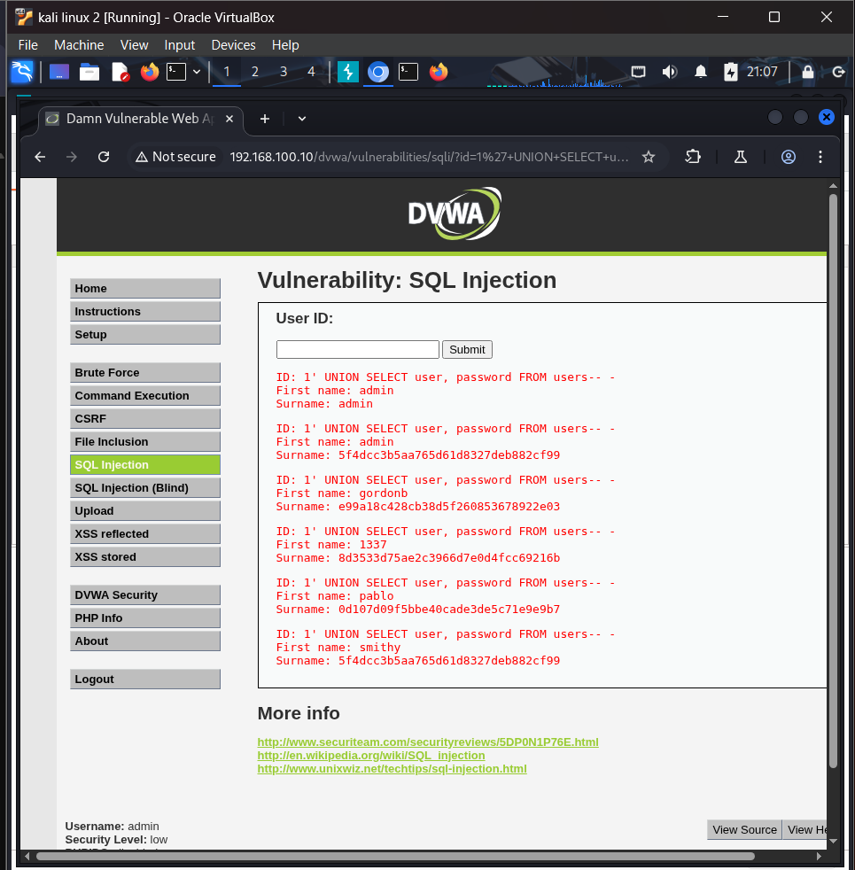

# DVWA Web Application Security Lab

Manual security assessment of DVWA (Damn Vulnerable Web App) hosted on
Metasploitable2, using Burp Suite to intercept and manipulate HTTP
requests. Covers two OWASP Top 10 categories with full attack chains,
from initial discovery through to demonstrated real-world impact.

## Setup

- **Target:** DVWA v1.0.7 on Metasploitable2 (192.168.100.10)
- **Attacker:** Kali Linux (192.168.100.30)
- **Proxy:** Burp Suite Community Edition (intercepting proxy at 127.0.0.1:8080)
- **Security level tested:** Low
- **Cracking tool:** John the Ripper

## Findings

### 1. SQL Injection (A03:2021 — Injection)

Full attack chain from authentication bypass through to credential
extraction and password cracking:

- Bypassed the query logic with `' OR '1'='1` to dump all user records
- Determined column count via `ORDER BY`
- Fingerprinted the database (MySQL 5.0.51a, database `dvwa`) using
  `UNION SELECT`
- Enumerated the schema via `information_schema.tables`, finding the
  `users` table
- Extracted all usernames and password hashes
- Cracked the `admin` password hash (`5f4dcc3b5aa765d61d8327deb882cf99`)
  in under 1 second using John the Ripper — password was `password`

Full writeup: [incident-01-sql-injection.md](./incident-01-sql-injection.md)

### 2. Cross-Site Scripting — Reflected & Stored (A03:2021 — Injection)

- **Reflected XSS:** injected ``
  into the Name field, executing in-browser and extracting the live
  `PHPSESSID` session cookie — demonstrating realistic session-hijacking
  impact, not just a proof-of-concept alert box
- **Stored XSS:** submitted a script payload into DVWA's guestbook; the
  payload persisted server-side and re-executed on a plain page reload
  with no resubmission, confirming every future visitor to the page
  would also be affected

Full writeup: [incident-02-xss.md](./incident-02-xss.md)

## Key takeaway

Both vulnerabilities stem from the same root cause pattern: **untrusted
user input is trusted and used directly** — either concatenated into a
SQL query, or rendered into HTML/JavaScript without encoding. Fixing
both categories relies on the same core principle: never trust input,
and always separate data from code (parameterized queries for SQL,
output encoding for HTML/JS).

## Tools used

`Burp Suite Community Edition` · `DVWA v1.0.7` · `Metasploitable2` ·
`Kali Linux` · `John the Ripper`