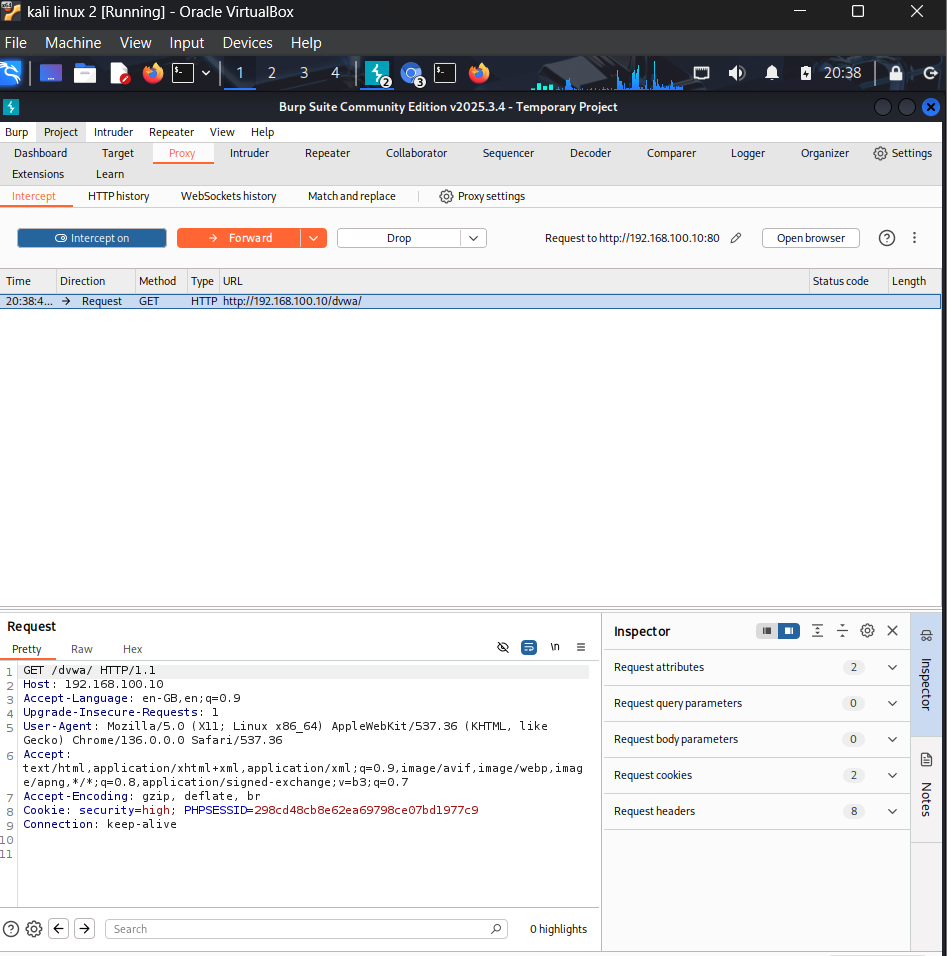
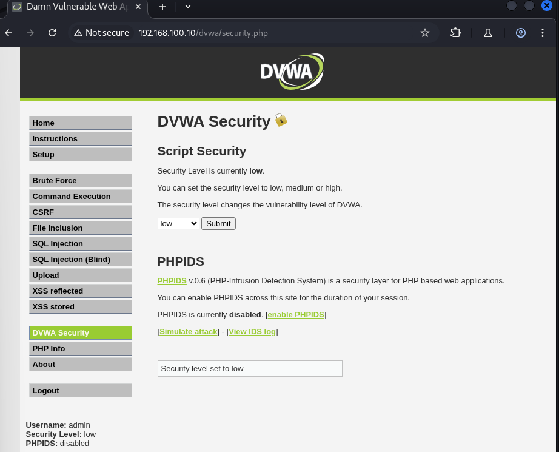
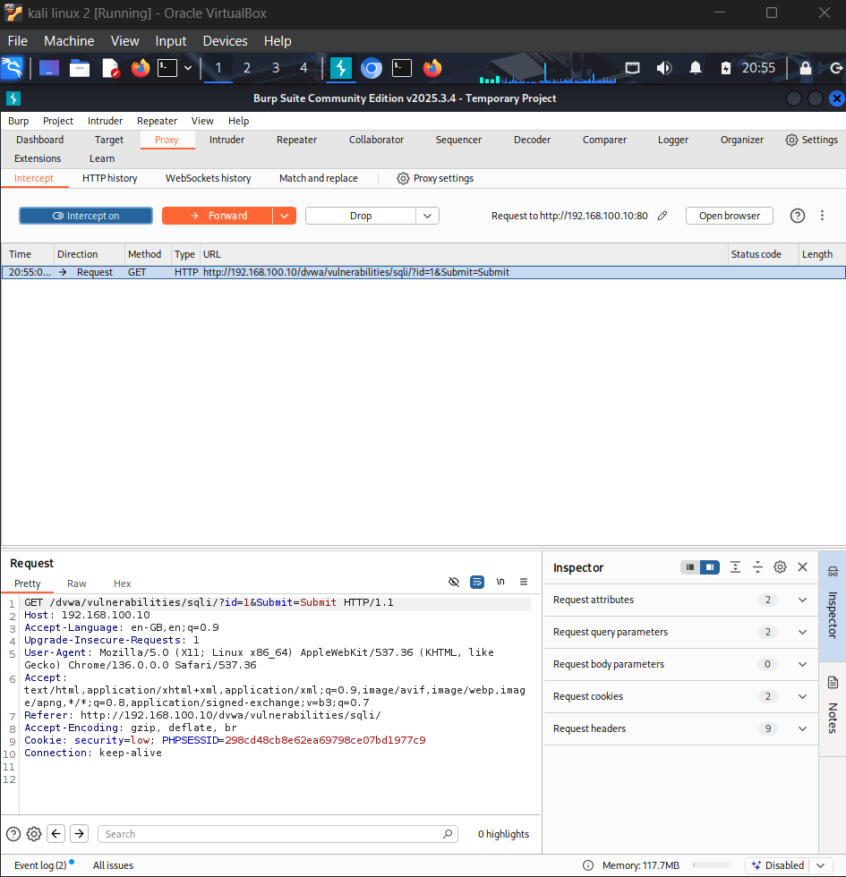
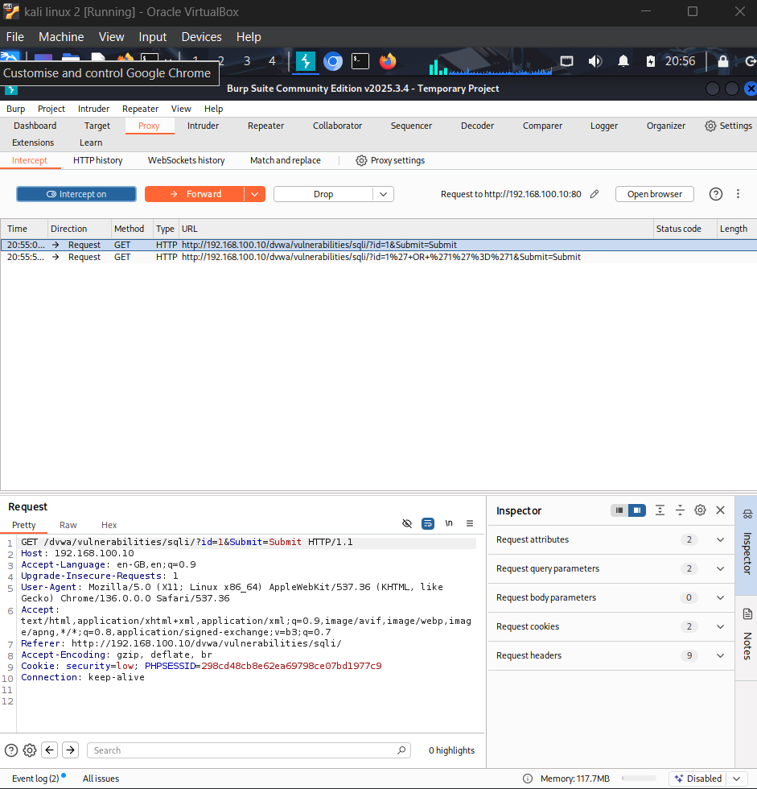
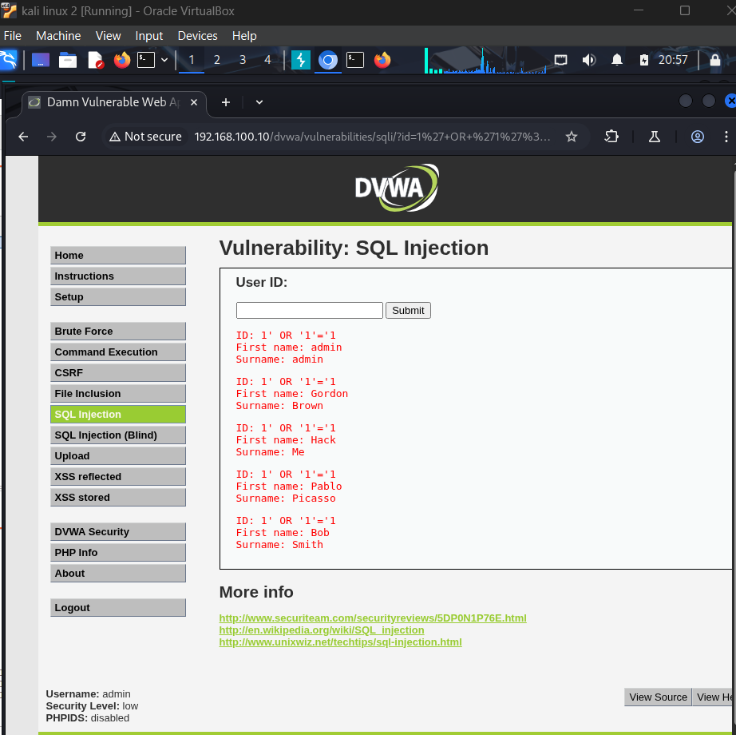
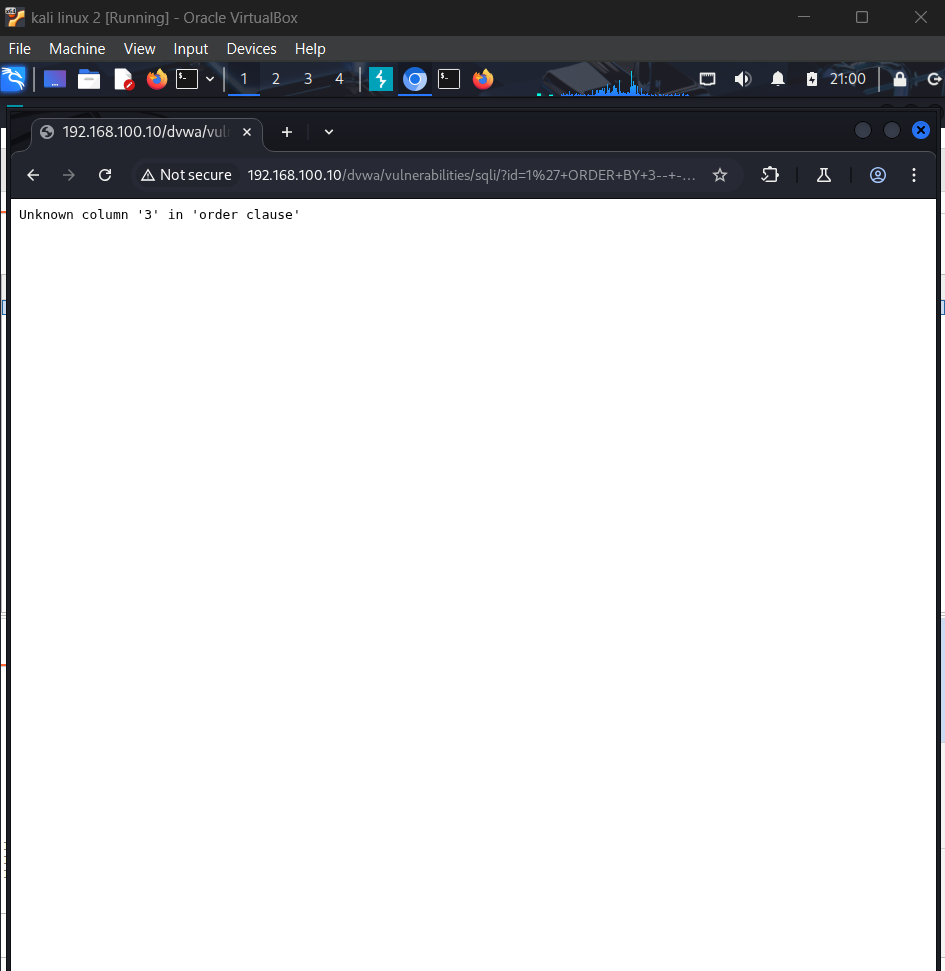
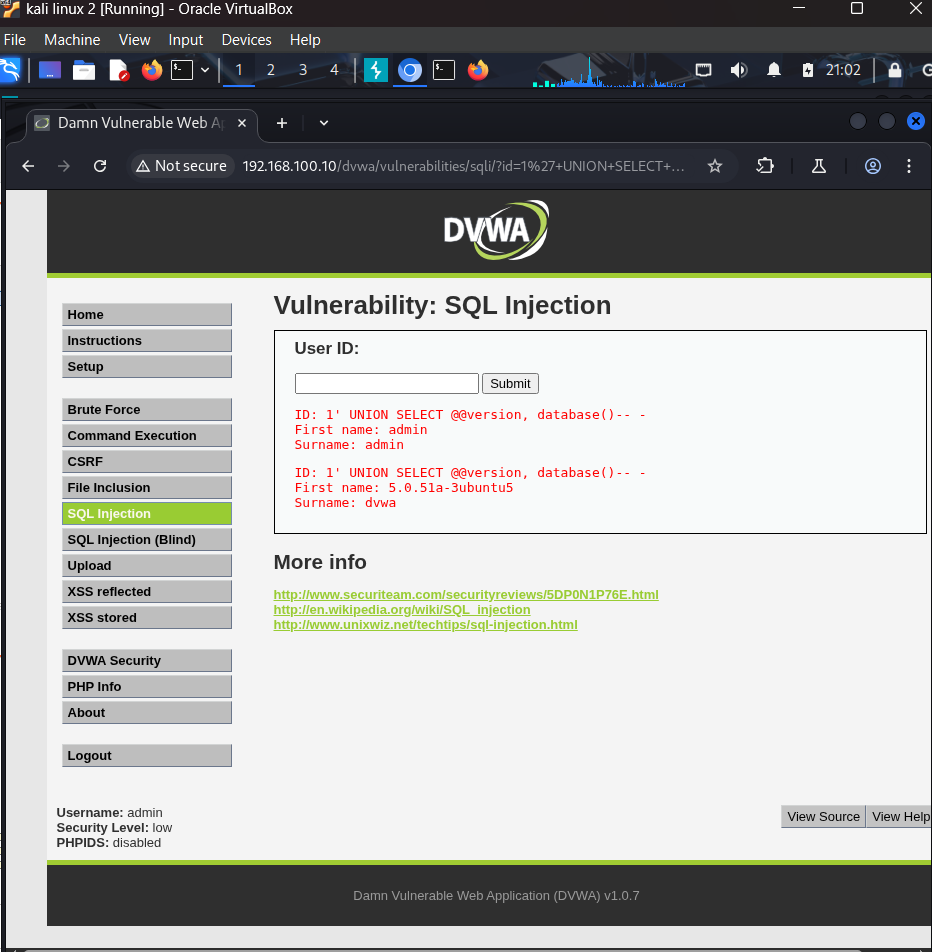
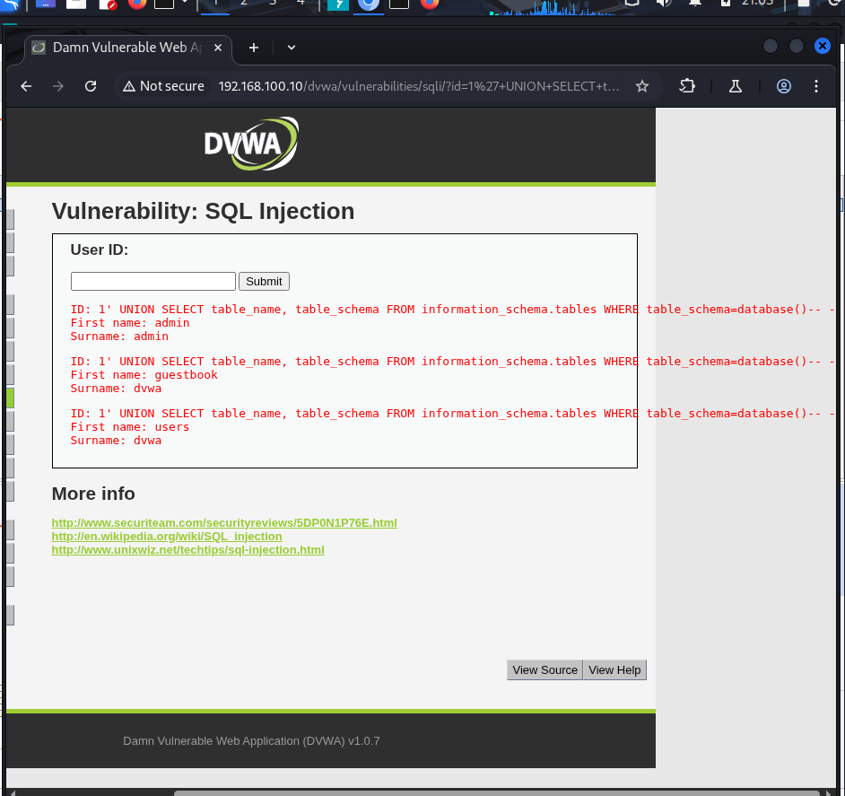
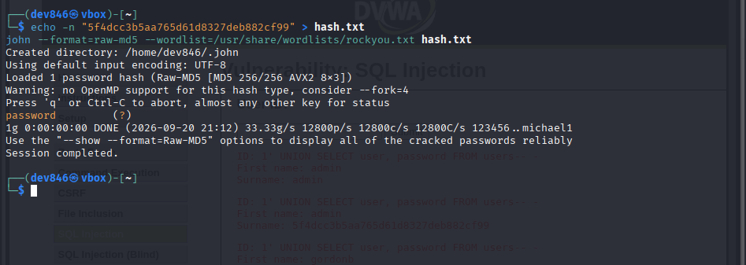

## Incident 1: SQL Injection — Authentication Bypass & Credential Extraction

**Date:** 2026-09-19/20
**Environment:** Isolated VirtualBox lab (Internal Network, 192.168.100.0/24)
**Target application:** DVWA (Damn Vulnerable Web App) v1.0.7, hosted on
Metasploitable2
**OWASP category:** A03:2021 — Injection

### Summary

Performed a manual SQL injection assessment against DVWA's "SQL Injection"
module at Low security level, using Burp Suite as an intercepting proxy.
Escalated from a basic authentication-bypass payload to full database
schema enumeration and credential extraction, then cracked a recovered
password hash to demonstrate real-world impact.

### Environment / Tools

- **Attacker:** Kali Linux (192.168.100.30)
- **Target:** Metasploitable2 (192.168.100.10) running DVWA
- **Proxy:** Burp Suite Community Edition (intercepting all browser traffic
  via 127.0.0.1:8080)
- **Cracking tool:** John the Ripper

### Step 1 — Intercepting traffic with Burp

Configured the browser to route all traffic through Burp Suite so every
request to DVWA could be inspected and manipulated before it reached the
server. Confirmed interception was working by capturing a live GET request.



DVWA security level was set to **Low** to test the vulnerability without
input sanitization in place.



### Step 2 — Baseline behavior

Submitted a normal value (`id=1`) into the User ID field to establish
expected behavior — a single user record returned.



### Step 3 — Authentication bypass payload

Submitted the payload:
```
1' OR '1'='1
```
Captured in Burp's HTTP history alongside the baseline request:



The underlying query is almost certainly structured as:
```sql
SELECT first_name, last_name FROM users WHERE user_id = '$id'
```
The payload turns this into:
```sql
SELECT first_name, last_name FROM users WHERE user_id = '1' OR '1'='1'
```
Since `'1'='1'` is always true, the WHERE clause matches every row. The
application returned **all 5 users** instead of the single requested
record, confirming the input was concatenated directly into the SQL
query with no sanitization.



### Step 4 — Determining column count

Used an `ORDER BY` payload to find the number of columns returned by the
query, required to build a working UNION SELECT:
```
1' ORDER BY 3-- -
```
This returned `Unknown column '3' in 'order clause'`, confirming the
query returns exactly **2 columns**.



### Step 5 — Database fingerprinting

```
1' UNION SELECT @@version, database()-- -
```
Extracted the MySQL version and current database name directly through
the application's output fields:
- **Version:** `5.0.51a-3ubuntu5`
- **Database:** `dvwa`



### Step 6 — Schema enumeration

```
1' UNION SELECT table_name, table_schema FROM information_schema.tables
WHERE table_schema=database()-- -
```
Queried MySQL's information_schema to enumerate tables inside the `dvwa`
database, identifying **`users`** and **`guestbook`**.



### Step 7 — Credential extraction

```
1' UNION SELECT user, password FROM users-- -
```
Dumped all usernames and password hashes from the `users` table:

| Username | Password hash (MD5) |
|---|---|
| admin | 5f4dcc3b5aa765d61d8327deb882cf99 |
| admin | e99a18c428cb38d5f260853678922e03 |
| gordonb | 8d3533d75ae2c3966d7e0d4fcc69216b |
| 1337 | 0d107d09f5bbe40cade3de5c71e9e9b7 |
| pablo | 5f4dcc3b5aa765d61d8327deb882cf99 |
| smithy | 5f4dcc3b5aa765d61d8327deb882cf99 |


### Step 8 — Password cracking

The 32-character hex hashes indicated unsalted **MD5**, a fast and weak
hashing algorithm. Cracked the `admin` hash using John the Ripper against
the rockyou.txt wordlist:
```
john --format=raw-md5 --wordlist=/usr/share/wordlists/rockyou.txt hash.txt
```
Result: cracked in **under 1 second** — the password was simply `password`.



### Impact

An unauthenticated (session-authenticated only, no additional
authorization) user could:
- Bypass intended query logic to read data outside their authorization
- Enumerate the full database schema
- Extract all user credentials
- Trivially crack weak/common password hashes, gaining full account
  takeover — including the `admin` account

This represents a complete compromise of the application's user data and
authentication system from a single unsanitized input field.

### Root cause

User input from the `id` parameter is concatenated directly into a SQL
query string rather than being parameterized, and password hashes are
stored using unsalted MD5 rather than a modern adaptive hashing
algorithm (bcrypt, scrypt, Argon2).

### Remediation recommendations

- Use parameterized queries / prepared statements for all database
  access — never concatenate user input into SQL strings
- Apply the principle of least privilege to the database account used
  by the application (should not have access to `information_schema`
  or other databases)
- Replace MD5 password hashing with a modern, salted, adaptive hashing
  algorithm (bcrypt, Argon2)
- Enforce a strong password policy to reduce the impact of any future
  hash exposure
- Enable a Web Application Firewall (WAF) as defense-in-depth, though
  this should not replace fixing the root cause
