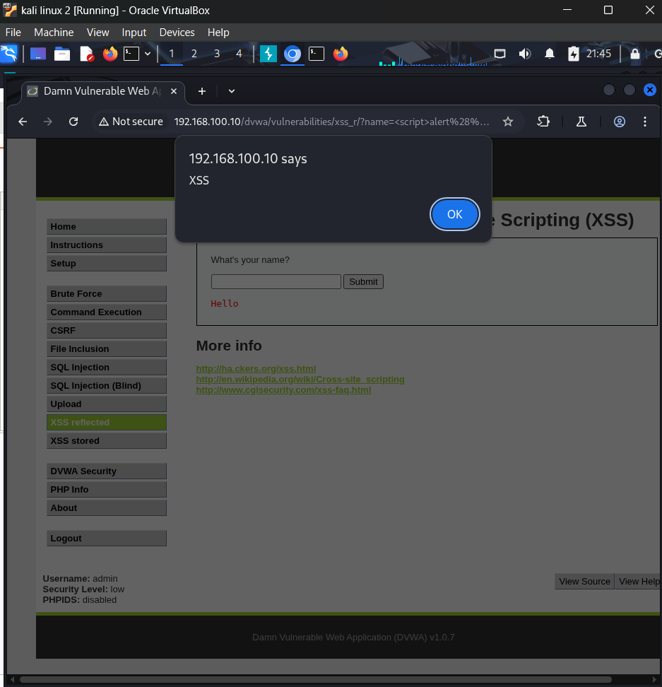
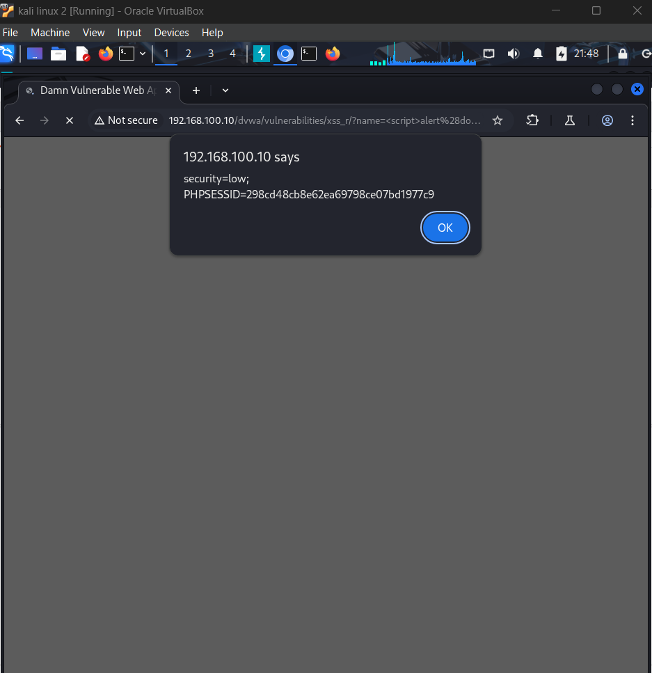
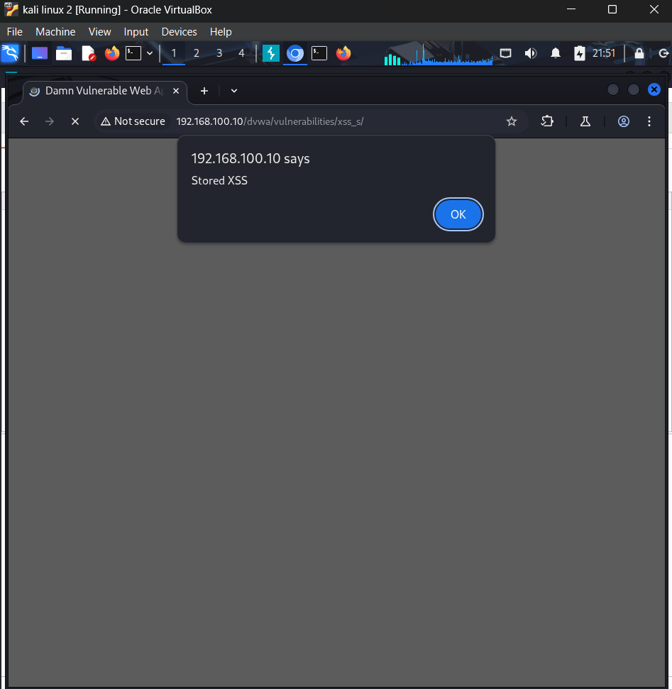

## Incident 2: Cross-Site Scripting (XSS) — Reflected & Stored

**Date:** 2026-09-20
**Environment:** Isolated VirtualBox lab (Internal Network, 192.168.100.0/24)
**Target application:** DVWA (Damn Vulnerable Web App) v1.0.7, hosted on
Metasploitable2
**OWASP category:** A03:2021 — Injection (Cross-Site Scripting)

### Summary

Tested DVWA's Reflected and Stored XSS modules at Low security level.
Confirmed both are vulnerable to arbitrary JavaScript execution due to
unsanitized user input being rendered directly into page HTML. Extended
the reflected finding to demonstrate session cookie theft, showing
realistic session-hijacking impact rather than a purely cosmetic alert box.

### Part A — Reflected XSS

**Payload:**
```
<script>alert('XSS')</script>
```
Submitted into the "Name" field on the XSS reflected module. The browser
executed the injected script instead of rendering it as text, confirming
the "Hello" response echoes user input without HTML-encoding it first.



The payload traveled as a URL query parameter:
```
http://192.168.100.10/dvwa/vulnerabilities/xss_r/?name=<script>alert('XSS')</script>
```
This confirms the vulnerability is **reflected** — the payload is not
stored anywhere; it only executes because the server reflects the raw
`name` parameter straight back into the HTML of the response.

**Demonstrating real impact — session cookie theft**

Replaced the payload with:
```
<script>alert(document.cookie)</script>
```
This successfully extracted the live session cookie value directly from
the browser:
```
security=low; PHPSESSID=298cd48cb8e62ea69798ce07bd1977c9
```



In a real attack, this script would silently send the cookie to an
attacker-controlled server (e.g. via an `` tag or `fetch()` call)
rather than displaying it in an alert box. With a stolen `PHPSESSID`, an
attacker could impersonate the victim's session without ever knowing
their password. This is typically delivered via a phishing link
containing the crafted URL.

### Part B — Stored XSS

**Payload:**
```
<script>alert('Stored XSS')</script>
```
Submitted into the Message field of DVWA's guestbook (XSS stored module).
The alert fired immediately on submission, and — critically — **fired
again on a plain page reload with no payload in the URL and no
resubmission**, confirming the script was saved server-side and now
executes for any visitor who simply views the page.



This is more severe than the reflected variant: no crafted link or
victim interaction is required — the payload permanently lives in the
application and will fire for every user (including administrators) who
views the affected page until it is removed.

### Impact

- **Reflected XSS:** enables phishing-style attacks where a victim clicks
  a crafted link, leading to session hijacking, credential theft via
  fake forms, or arbitrary actions performed as the victim
- **Stored XSS:** persistent compromise affecting every visitor to the
  page, including potentially higher-privileged users such as
  administrators reviewing submissions — significantly higher blast
  radius than the reflected variant

### Root cause

User-supplied input (`name` parameter, guestbook `message` field) is
rendered directly into HTML output without encoding special characters
(`<`, `>`, `"`, `'`), allowing injected `<script>` tags to be parsed and
executed by the browser as active content instead of inert text.

### Remediation recommendations

- HTML-encode all user-supplied output before rendering (e.g. convert
  `<` to `&lt;`, `>` to `&gt;`)
- Apply context-aware output encoding consistently across all input
  reflected into HTML, JavaScript, or URL contexts
- Implement a Content Security Policy (CSP) to restrict inline script
  execution as defense-in-depth
- Set the `HttpOnly` flag on session cookies to prevent them being read
  via `document.cookie`, mitigating the impact of any XSS that does slip
  through
- Validate and sanitize input server-side; do not rely on client-side
  validation alone
