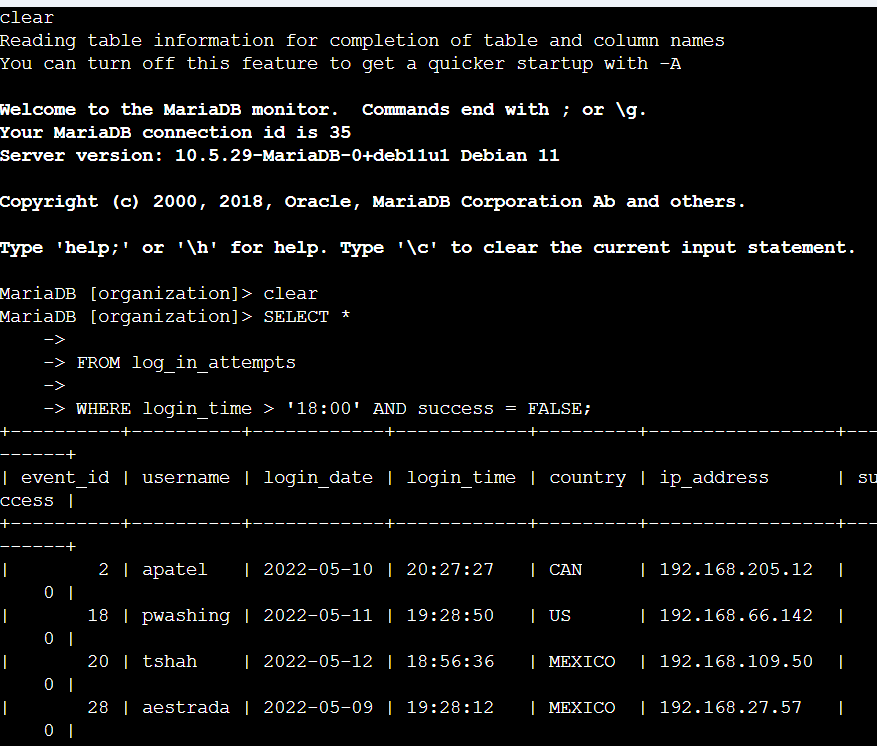
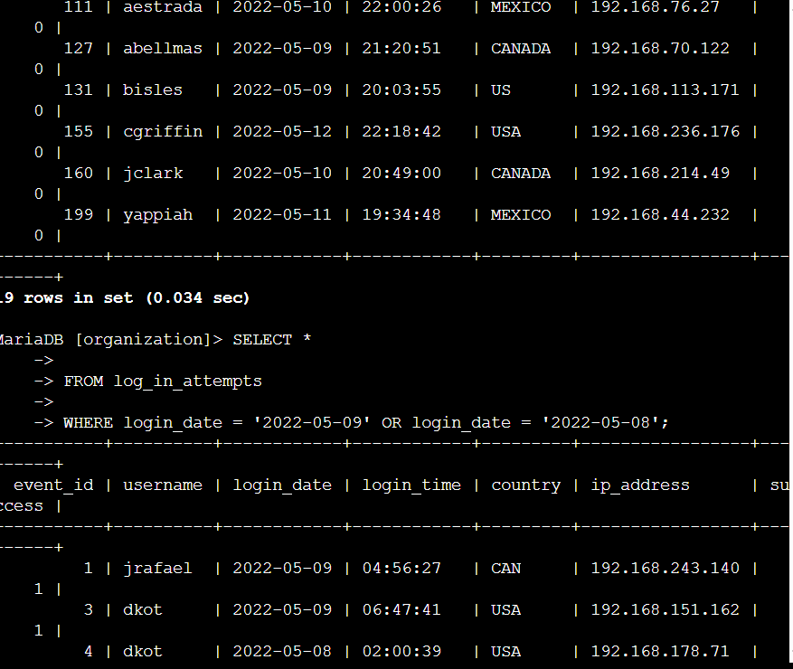
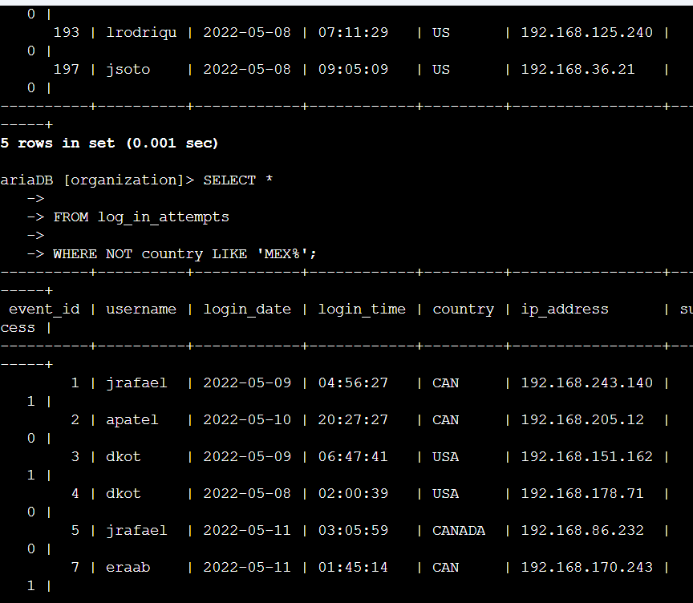
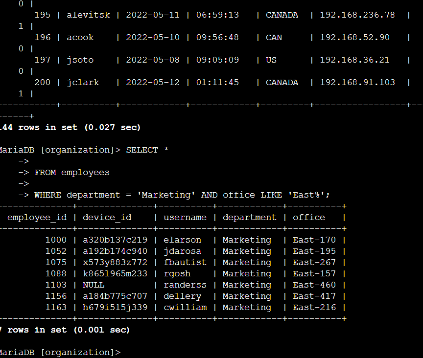
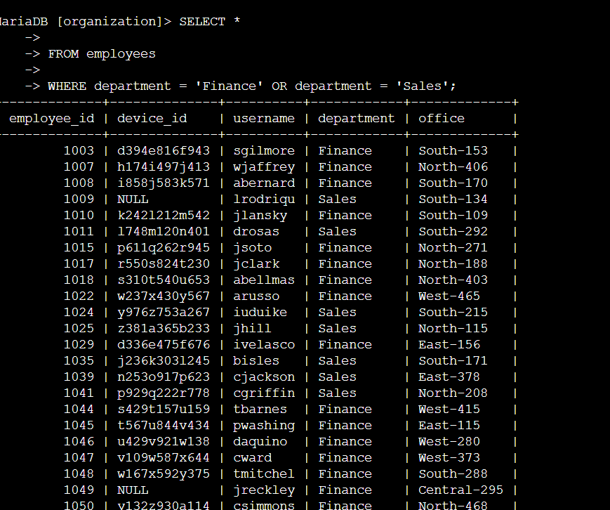
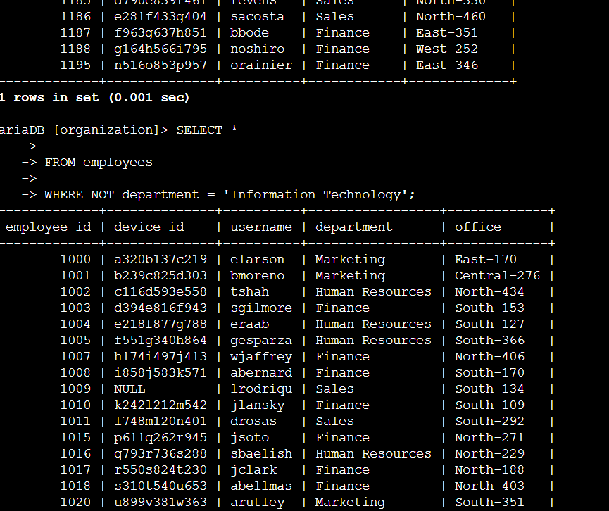

# Apply Filters to SQL Queries

## Objective
Used SQL with filtering operators (`AND`, `OR`, `NOT`, `LIKE`) against a MariaDB database
to investigate login activity and identify employee machines requiring security updates.

## Database Tables
- **log_in_attempts**: event_id, username, login_date, login_time, country, ip_address, success
- **employees**: employee_id, device_id, username, department, office

## Retrieve after-hours failed login attempts



```sql
SELECT *
FROM log_in_attempts
WHERE login_time > '18:00' AND success = FALSE;
```
Used `AND` to filter for login attempts that both occurred after 18:00 and failed —
narrowing results to only the after-hours failures that needed investigation.

## Retrieve login attempts on specific dates



```sql
SELECT *
FROM log_in_attempts
WHERE login_date = '2022-05-09' OR login_date = '2022-05-08';
```
Used `OR` to pull login activity from either of the two dates surrounding a suspicious
event, rather than requiring both conditions to match.

## Retrieve login attempts outside of Mexico



```sql
SELECT *
FROM log_in_attempts
WHERE NOT country LIKE 'MEX%';
```
Used `NOT` combined with `LIKE` and the `%` wildcard to exclude both "MEX" and "MEXICO"
entries in a single condition, since the dataset represented Mexico inconsistently.

## Retrieve employees in Marketing (East office)



```sql
SELECT *
FROM employees
WHERE department = 'Marketing' AND office LIKE 'East%';
```
Combined `AND` with a `LIKE` wildcard to isolate Marketing employees specifically in
East-building offices, ahead of a scheduled machine update.

## Retrieve employees in Finance or Sales



```sql
SELECT *
FROM employees
WHERE department = 'Finance' OR department = 'Sales';
```
Used `OR` to return employees from either department for a shared security update,
without requiring both conditions simultaneously.

## Retrieve all employees not in IT



```sql
SELECT *
FROM employees
WHERE NOT department = 'Information Technology';
```
Used `NOT` to exclude the IT department entirely, isolating every employee due for a
separate update cycle.

## Summary
Applied `AND`, `OR`, `NOT`, and `LIKE` (with the `%` wildcard) across two tables to
investigate login activity and identify specific employee groups for targeted security
actions — narrowing large datasets down to precisely the records relevant to each task.

## Skills Demonstrated
SQL querying, logical filtering operators, wildcard pattern matching, database
investigation for security incident response