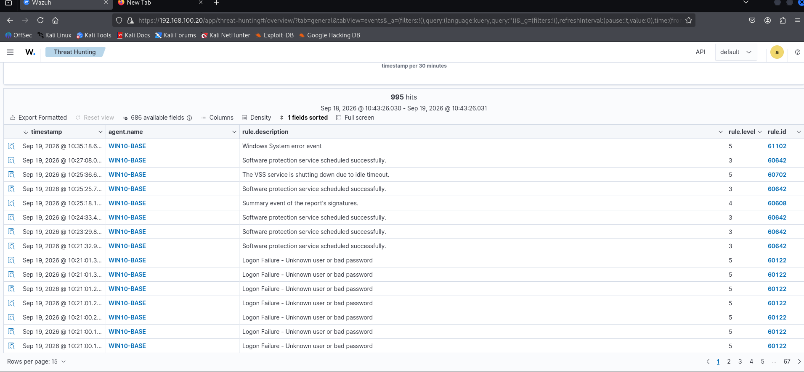

# SOC / Blue Team Lab — Wazuh Detection Engineering

Small security lab built in VirtualBox: Wazuh SIEM monitoring a Windows 10
endpoint, with a simulated RDP brute-force attack from Kali Linux to
validate detection end-to-end.

## Setup

- **Wazuh manager + dashboard** (v4.14.6, OVA deployment)
- **Windows 10 endpoint** (WIN10-BASE) with Wazuh agent installed
- **Kali Linux** as the attacking host
- Isolated VirtualBox Internal Network (`192.168.100.0/24`), static IPs
  assigned manually (no DHCP on internal networks)

| Host | Role | IP |
|---|---|---|
| Wazuh manager | SIEM / detection | 192.168.100.20 |
| WIN10-BASE | Monitored endpoint | 192.168.100.40 |
| Kali Linux | Attacker | 192.168.100.30 |

## What I did

1. Networked all VMs on an isolated internal segment and assigned static IPs
2. Installed and enrolled the Wazuh agent on the Windows 10 endpoint
3. Ran an Nmap scan against the endpoint (service/version detection,
   NSE scripts) — surfaced an RDP NTLM info disclosure issue and an SMB
   signing misconfiguration
4. Ran a Hydra RDP brute-force attack against the Administrator account
5. Verified detection in the Wazuh dashboard — individual failed-logon
   events (rule 60122) correlated by Wazuh into a high-severity
   "Multiple Windows Logon Failures" alert (rule 60204, MITRE T1110)

Full writeup with all supporting evidence:
[incident-01-rdp-bruteforce.md](./incident-01-rdp-bruteforce.md)

## Key finding

Wazuh's correlation engine escalated repeated low-severity failed-login
events into a high-severity brute-force alert once the failure threshold
was crossed — demonstrating real detection logic, not just log collection.
Every alert was automatically tagged against MITRE ATT&CK, GDPR, HIPAA,
PCI DSS, and NIST 800-53 — useful compliance context for a real SOC
environment.

## Tools used

`VirtualBox` · `Wazuh 4.14.6` · `Kali Linux` (Nmap, Hydra) · `Windows 10`
