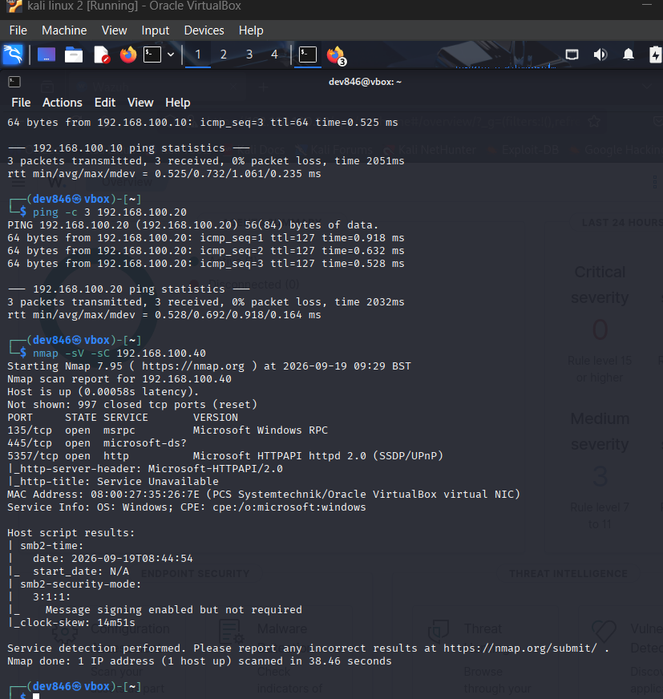
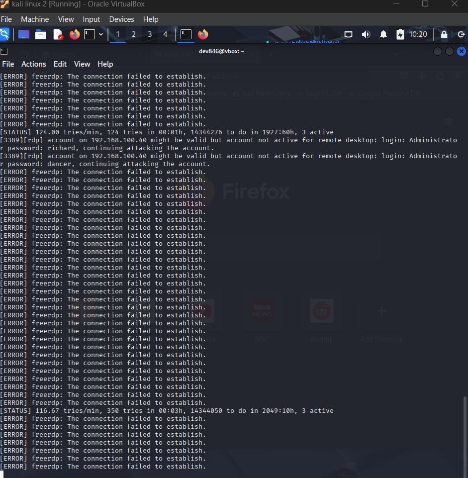
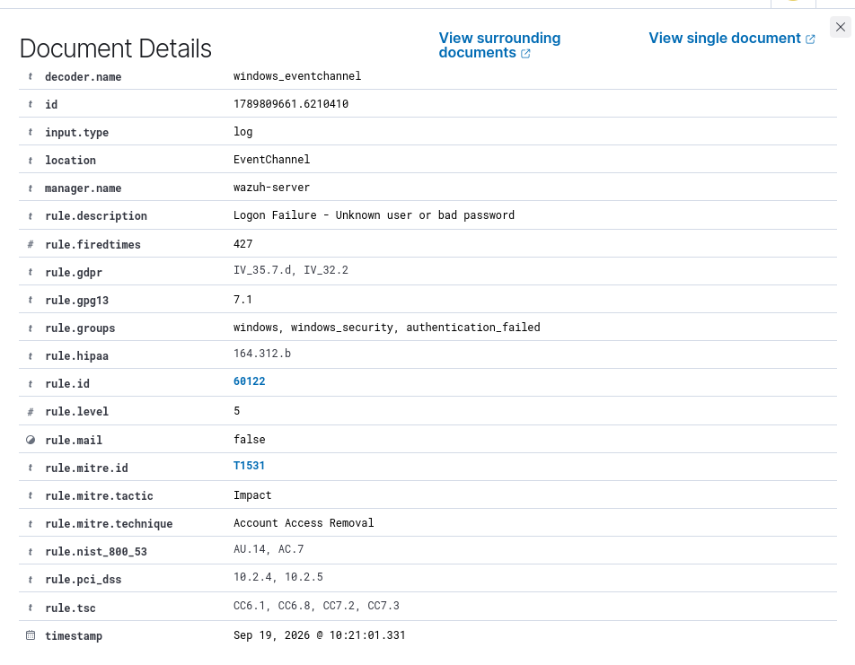
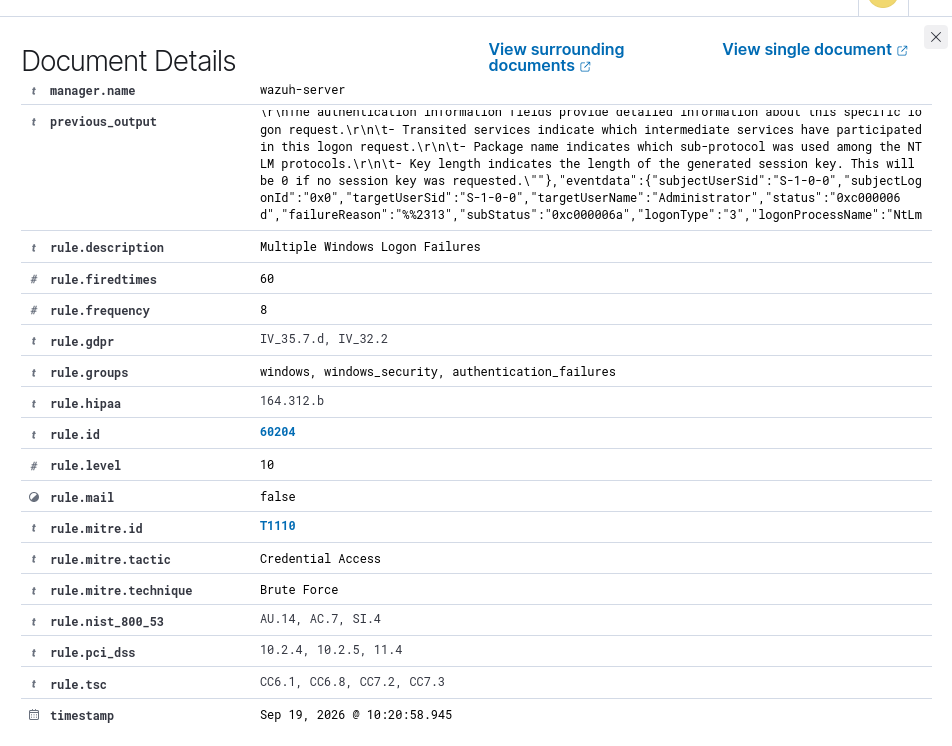

## Incident 1: RDP Brute-Force Attack Detection

**Date:** 2026-09-19
**Environment:** Isolated VirtualBox lab (Internal Network, 192.168.100.0/24)

### Summary
Simulated an RDP brute-force attack against a monitored Windows 10
endpoint and validated detection via Wazuh SIEM.

### Attack

**Reconnaissance** — Nmap scan against the target flagged RDP NTLM info
disclosure (domain "CORP", hostname "WIN10-01", DNS "corp.bank.local"
leaked pre-authentication) and SMB signing enabled but not enforced.

- **Source:** Kali Linux (192.168.100.30)
- **Target:** WIN10-BASE / WIN10-01.corp.bank.local (192.168.100.40)
- **Tool:** THC-Hydra, rockyou.txt wordlist
- **Command:** `hydra -l Administrator -P /usr/share/wordlists/rockyou.txt -t 4 rdp://192.168.100.40`

### Detection

Wazuh agent on WIN10-BASE forwarded Windows Security Event ID 4625
(failed logon) to the manager in real time.

- **Rule 60122** (level 5) fired per failed attempt — MITRE T1531

- **Rule 60204 "Multiple Windows Logon Failures"** (level 10) fired after
  the correlation threshold (8 failures) was crossed within the rule's
  time window — MITRE T1110, tactic: Credential Access

Alert correctly attributed the source IP (192.168.100.30) and target
account (Administrator) from the raw Windows event data.

### Finding of note
Hydra reported several passwords as valid against the Administrator
account but flagged as "not active for remote desktop" — indicating the
account was not authorized for RDP access despite valid credentials,
demonstrating defense-in-depth beyond password strength alone.

### Remediation recommendations
- Enforce account lockout policy after N failed attempts
- Restrict RDP access via NLA and IP allowlisting / VPN-only access
- Enforce SMB signing (currently enabled but not required)
- Suppress or restrict unauthenticated RDP NTLM info disclosure